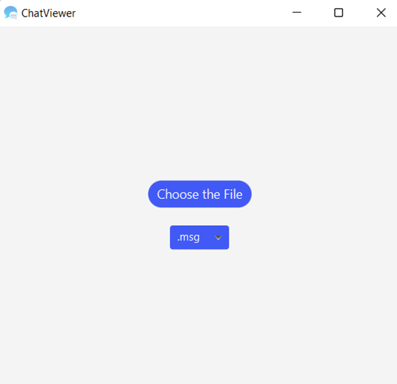

# Chat-Viewer
Chat Viewer is a standalone graphical application that can display a chat conversation 
which is stored in a file with a specific format.

## Installation Requirements

`Javafx library` : javafx library should be added to the project structure

`JUnit4 (junit-4.13.1.jar)` : Junit4 is required for running unit tests

## Usage

The application allows users to choose the desired file extension. 
File extension options are the following: `.msg`, `.txt`, `.tex`

The provided file should correspond to the format specified for the Chat Viewer application.
The example files are provided in the `example_msg_files` folder.

